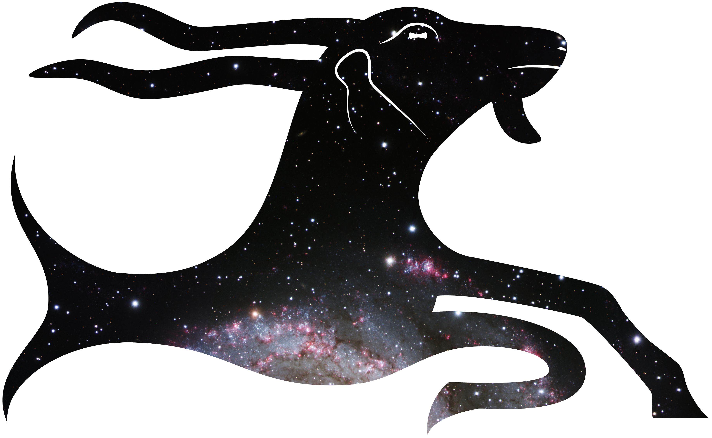

# Zodiac Glossary Test Page

This is a work-in-progress version of the Zodiac Glossary, part of [ZODIAC – Ancient Astral Science in Transformation](https://www.geschkult.fu-berlin.de/en/e/zodiac/index.html) an ERC-funded research project at FU Berlin.
This is a place where I build new features for other collaborators to try out.

## Refactored with routing

URL routing is crucial to the proper functioning of the site. 
Lemma IDs must be unique, permanent, and most importantly, sharable.
This new version includes the current lemma ID in the URL,
and a query string with search information.
This way, users can copy and share URLs with full confidence that whoever uses their URL will see the same data.

Trying to add URL routing to the existing messy test site proved unmanageable, so I created this new version.
Though it reuses much of the old site, it has been completely redesigned to be more streamlined.

## Test page

Use the [github pages site](https://christiancasey.github.io/zodiac-routing/) to see the latest features in development.

## About ZODIAC

Astrology, Astronomy, Mathematics, Religion and Philosophy – all these different aspects and their theories and practices, texts and images, meet in the concept of the zodiac. 2500 years ago, in the 5th century BCE, the introduction of the zodiac in Babylonia marked a turning point in human culture and science. The zodiacal turn was accompanied by a mathematical turn in the astral sciences and a personal turn in astrology. From Babylonia, zodiacal astral science spread to Egypt, the Greco-Roman world, and beyond.

